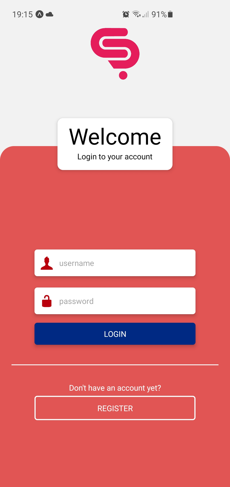
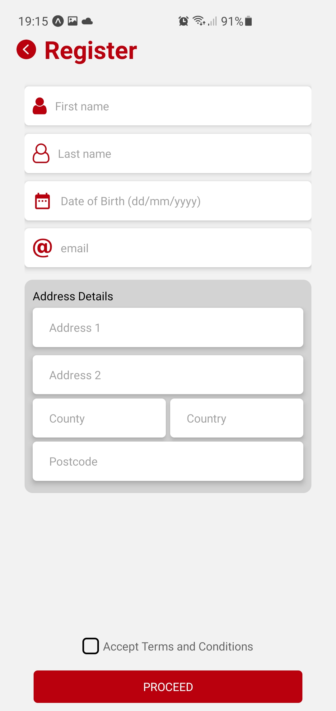
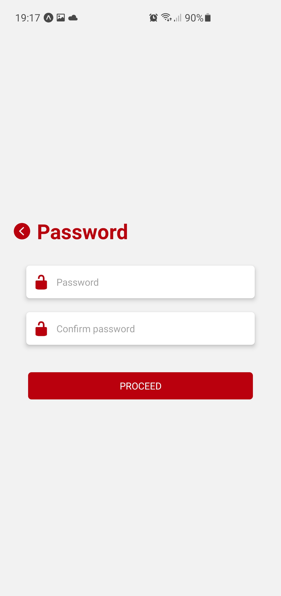
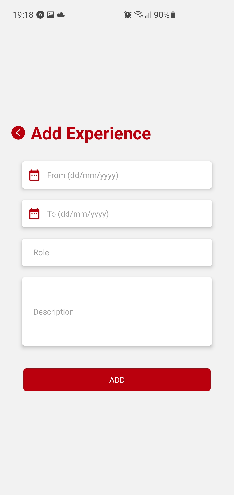
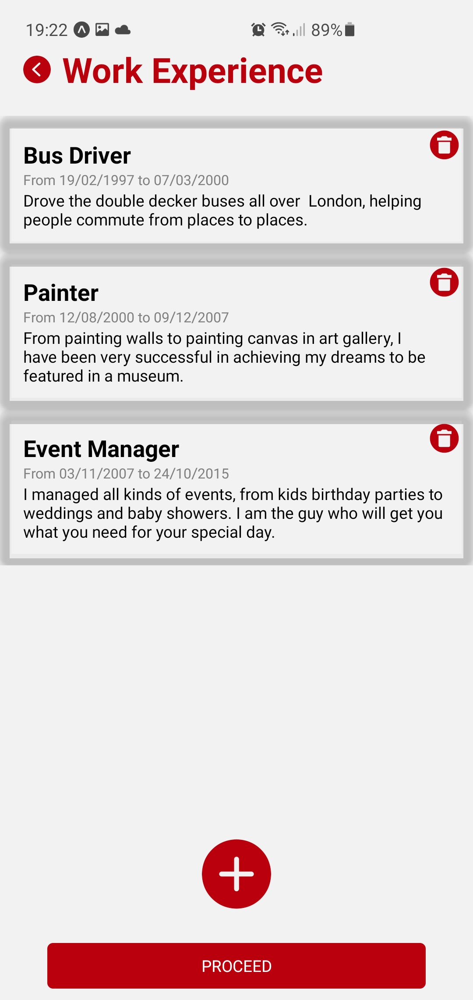
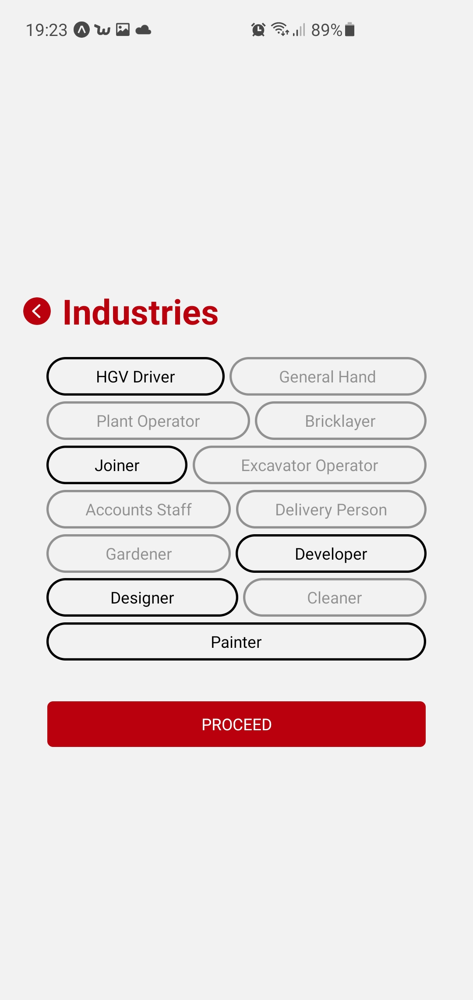
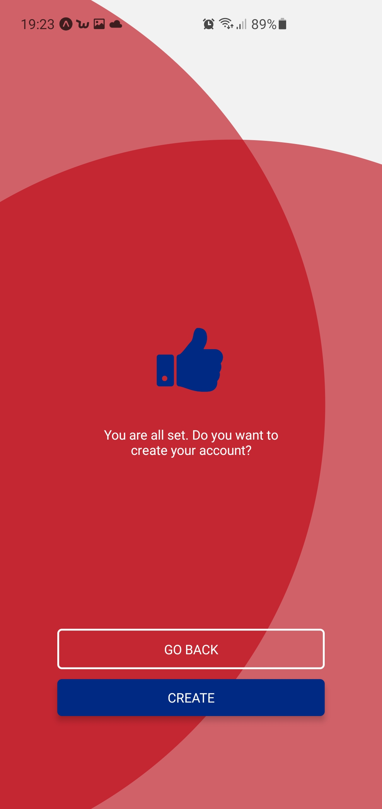
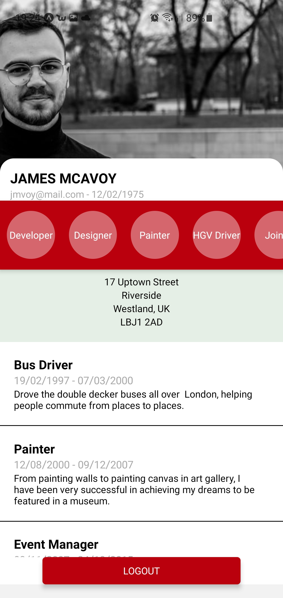

<h1>Sugar Rush Creative Tech Test </h1>

<h2>Screenshots</h2>

  
  
  
  
  
  
  
  

<h2>Getting started</h2>

Follow these instructions to build the app.

1. Clone this repo.
2. Navigate to the root directory
3. Install all the dependencies using terminal `yarn install`
4. Start the App in terminal `yarn start`
5. Launch the App on your `Device` or `Emulator/Simulator` using `Expo Go` App

> <h2> Notes </h2>
> When entering fields make sure to use a valid email address.

<h2>Tech Stack</h2>
- Javascript
- React Native
- Context
- Expo
